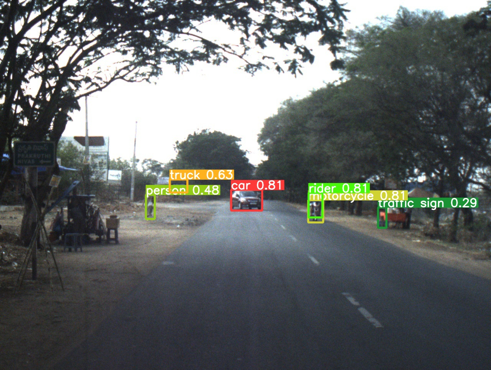

## 1. YOLOv8 

## 1.1 Installation
(If you want to use this on Kaggle, this step can be skipped)
```
git clone https://github.com/kai-weiss/AACVProject.git
cd AACVProject/YOLOv8
pip install -r requirements.txt
```

## 1.2 Training
### 1.2.1 How to train the model locally
- Download the dataset under https://kaggle.com/datasets/fcd636ded04af634ec210e3a5316c42837e2220cb794a84e31fae2808e565f8a
  (Old dataset with 15 classes: https://kaggle.com/datasets/0a201d5cb8eba5c1a719be8d390f5af4b93aa7a4057db962afbb4b08fb5183ec )
- Under ..\AACVProject\YOLOv8\config.yaml: Modify the path to the path of your downloaded dataset
- run ..\AACVProject\YOLOv8\train.py
- See results in ..\AACVProject\YOLOv8\run\train

### 1.2.2 How to train the model on Kaggle
- Go to https://www.kaggle.com/code/kaiweiss/aacv-project/edit
- Click on the 'Save Version' button and let it run
- See results in https://www.kaggle.com/code/kaiweiss/aacv-project/output

### 1.3 How to validate the model
- Make sure the path to your downloaded dataset in config.yaml is correct (see 1.2.1)
- run ..\AACVProject\YOLOv8\validate.py
- See results in ..\AACVProject\YOLOv8\run\val

### 1.4 How to test the model
- Make sure the path to your downloaded dataset in config.yaml is correct (see 1.2.1)
- Hint: It's possible to run this script for videos and images
- run ..\AACVProject\YOLOv8\predict.py
- See results in ..\AACVProject\YOLOv8\run\predict

### 1.5 Results

Validation results for YOLOv8 (shrunk dataset!):

'metrics/precision(B)': 0.5814474585650324  
'metrics/recall(B)': 0.361319506335979  
'metrics/mAP50(B)': 0.38595999973569306  
'metrics/mAP50-95(B)': 0.24080287991266427  
'fitness': 0.25531859189496714

Example Test result (shrunk dataset!):




## 2. YOLOv8 + CBAM

## 3. YOLOv8 + CBAM + RL

## 4. Others

### 4.1 View any live run that you started on Kaggle:
https://wandb.ai/kaiweiss0/projects
