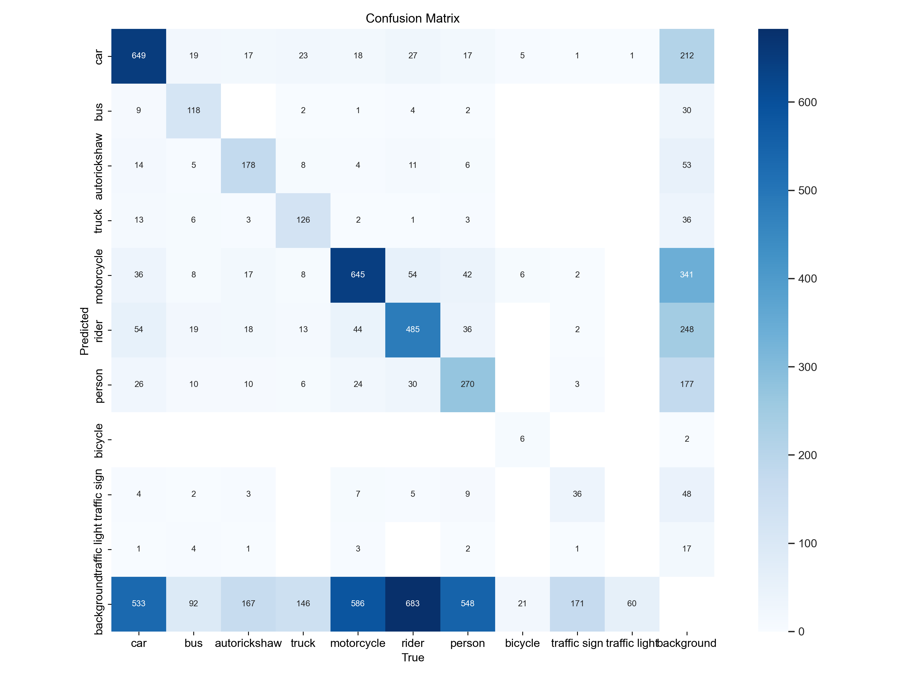
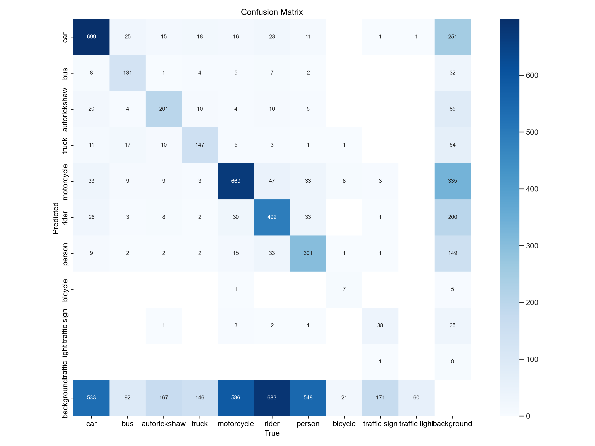

## APPROACHES

## 1. YOLOv8 

## 1.1 Installation
(If you want to use this on Kaggle, this step can be skipped)
```
git clone https://github.com/kai-weiss/AACVProject.git
cd AACVProject/YOLOv8
pip install -r requirements.txt
```

## 1.2 Experiment
Here we present the code for the approach described in Section **4.1** of our paper.
### 1.2.1 How to train the model locally
- Download the dataset under https://kaggle.com/datasets/fcd636ded04af634ec210e3a5316c42837e2220cb794a84e31fae2808e565f8a \
  (Old dataset with 15 classes: https://kaggle.com/datasets/0a201d5cb8eba5c1a719be8d390f5af4b93aa7a4057db962afbb4b08fb5183ec )
- Under [config.yaml](YOLOv8%2Fconfig.yaml): Modify the path to the path of your downloaded dataset
- Run [train.py](https://github.com/kai-weiss/AACVProject/blob/master/YOLOv8/train.py). 
- See results in [runs](https://github.com/kai-weiss/AACVProject/tree/master/YOLOv8/runs).


### 1.2.2 How to train the model on Kaggle
- Go to https://www.kaggle.com/code/kaiweiss/aacv-project/edit
- Click on the 'Save Version' button and let it run
- See results in https://www.kaggle.com/code/kaiweiss/aacv-project/output
- View any live run that you started on Kaggle: https://wandb.ai/kaiweiss0/projects

### 1.3 How to validate the model
- Make sure the path to your downloaded dataset in config.yaml is correct (see [1.2.1](#121-how-to-train-the-model-locally))

- Run [validate.py](https://github.com/kai-weiss/AACVProject/blob/master/YOLOv8/validate.py).
- See results in [runs](https://github.com/kai-weiss/AACVProject/tree/master/YOLOv8/runs).

### 1.4 How to test the model
- Make sure the path to your downloaded dataset in config.yaml is correct (see [1.2.1](#121-how-to-train-the-model-locally))
- Hint: It's possible to run this script for videos and images
- Run [predict.py](https://github.com/kai-weiss/AACVProject/blob/master/YOLOv8/predict.py). 
- See results in [runs](https://github.com/kai-weiss/AACVProject/tree/master/YOLOv8/runs).

The results of this approach have been described in Section **5.1** of our paper.

## 2. YOLOv8 + Weighted BCE Loss

Here we present the code for the approach described in Section **4.2** of our paper.

We conducted the following three experiments using different weights for the minority, moderate, and majority classes, along with varying the IoU thresholds for NMS:

* Strict class weights and higher IoU threshold (0.7)
* Lenient class weights and higher IoU threshold (0.7)
* Lenient class weights and lower IoU threshold (0.5)


Check the directory [Weighted BCE Loss](https://github.com/kai-weiss/AACVProject/blob/master/Weighted%20BCE%20Loss) for the code.

* Please make sure that you followed the installation steps in [1.1](#11-Installation).

* Go to site packages in your IDE, and replace the ultralytics\utils\loss.py file with [Weighted BCE Loss/loss.py](https://github.com/kai-weiss/AACVProject/blob/master/Weighted%20BCE%20Loss/loss.py) file. Currently, the class-wise weights are set to lenient. Please check the code snippet (line 165-171 in the .py file) and use the weights you require.
  ```python
  # strict class weights
  # class_weights = torch.tensor([0.50, 1.00, 1.00, 1.00, 0.50, 0.50, 0.50, 2.00, 2.00, 2.00], dtype=torch.float16).to(device)
  # lenient class weights
  class_weights = torch.tensor([1.00, 1.00, 1.00, 1.00, 1.00, 1.00, 1.00, 2.00, 2.00, 2.00], dtype=torch.float16).to(device)
  self.bce = nn.BCEWithLogitsLoss(pos_weight=class_weights, reduction="none")

* Use the [.yaml file](https://github.com/kai-weiss/AACVProject/blob/master/Weighted%20BCE%20Loss/data/idd_data.yaml) provided. You can change the path as per your dataset path.

* After the above changes, run [Weighted BCE Loss/weightedbce_main.py](https://github.com/kai-weiss/AACVProject/blob/master/Weighted%20BCE%20Loss/weightedbce_main.py). Currently the iou threshold is set to 0.5. We experimented with the values 0.7 and 0.5 for the iou threshold.
```python
results = model.train(data="/data/idd_data.yaml", epochs=200, iou=0.5)
```

The results of this approach have been described in Section **5.2** of our paper.

Out of the three experiments, lenient weights with lower iou threshold (0.5) performed the best.

## 3. YOLOv8 + Focal Loss

Here we present the code for the approach described in Section **4.3** of our paper.

Check the directory [Focal Loss](https://github.com/kai-weiss/AACVProject/tree/master/Focal%20Loss) for the code.

* Please make sure that you followed the installation steps in [1.1](#11-Installation).

* Go to site packages in your IDE, and replace the ultralytics\utils\loss.py file with [Focal Loss/loss.py](https://github.com/kai-weiss/AACVProject/blob/master/Focal%20Loss/loss.py) file. 

* Use the [.yaml file](https://github.com/kai-weiss/AACVProject/blob/master/Focal%20Loss/data/idd_data.yaml) provided. You can change the path as per your dataset path.

* After the above changes, run [Focal Loss/focalloss_main.py](https://github.com/kai-weiss/AACVProject/blob/master/Focal%20Loss/focalloss_main.py).

The results of this approach have been described in Section **5.3** of our paper.

## 4. YOLOv8 + Hierarchical Classification

* Please make sure that you followed the installation steps in [1.1](#11-Installation).

* Run [predict_with_extraction_main.py](YOLOv8%2FHierarchical_classification%2Fpredict_with_extraction_main.py) to receive the original predictions.
Make sure that `save_json=True`. Be aware that, for now, the script is configured to run on the val datset (check [config.yaml](YOLOv8%2Fconfig.yaml)).

* Afterwards, run [hierarchical_classification_main.py](YOLOv8%2FHierarchical_classification%2Fhierarchical_classification_main.py) to get the new calculated predictions. There are several boolean variables that can be set here:
  * `calc_hierarchical_classification = True`: Runs the hierarchical classification algorithm.
  * `save_new_predictions = True`: Save the results to .json file.
  * `plot_new_images = True`: Plot the new predicions on the images. Make sure you enter the images you want in `unique_image_ids`. 
  * `validate_hier_classification = True`: Do the validation with the new predictions.

The results of this approach have been described in Section **5.4** of our paper.

## 5. YOLOv8 + Ensemble Learning

Here we present the code for the approach described in Section **4.5.1** of our paper.

Check the directory [Ensemble Learning](https://github.com/kai-weiss/AACVProject/tree/master/Ensemble%20Learning) for the code. 

* Please make sure that you followed the installation steps in [1.1](#11-Installation).

* The weights for the larger general model and specialized helper model are available as .pt files in [Ensemble Learning/ensemble_models](https://github.com/kai-weiss/AACVProject/tree/master/Ensemble%20Learning/ensemble_models). Use these .pt files to initialize the models in [Ensemble Learning/custom_val.py](https://github.com/kai-weiss/AACVProject/blob/master/Ensemble%20Learning/custom_val.py) file. Please note, this .py file assumes that model1 is the bigger model, and model2 is the smaller model (hence, use .pt weights accordingly). Simply run this .py file to get the evaluation metrics for the ensemble. 

* No changes need to be made to the files [Ensemble Learning/ensemble_learning.py](https://github.com/kai-weiss/AACVProject/blob/master/Ensemble%20Learning/ensemble_learning.py) and [Ensemble Learning/custom_validator.py](https://github.com/kai-weiss/AACVProject/blob/master/Ensemble%20Learning/custom_validator.py) The former .py file ensembles the prediction results from the two models of the ensemble. The latter .py file makes changes to YOLOv8's BaseValidator to generate the evaluation results for the ensemble.

The results of this approach have been described in Section **5.5.1** of our paper.

## RESULTS: Evaluation Metrics:

### Results: all classes (average of all classes)


### Results: minority classes 


## RESULTS: Confusion Matrices

**1. YOLOv8**


**2. YOLOv8 + Weighted BCE**

* Strict class weights and higher IoU threshold (0.7)


* Lenient class weights and higher IoU threshold (0.7)


* Lenient class weights and lower IoU threshold (0.5)


**3. YOLOv8 + Focal Loss**


**4. YOLOv8 + Hierarchical Classification**
* Selective Hierarchical Classification:

* Universal Hierarchical Classification:


**5. YOLOv8 + Ensemble Learning**

